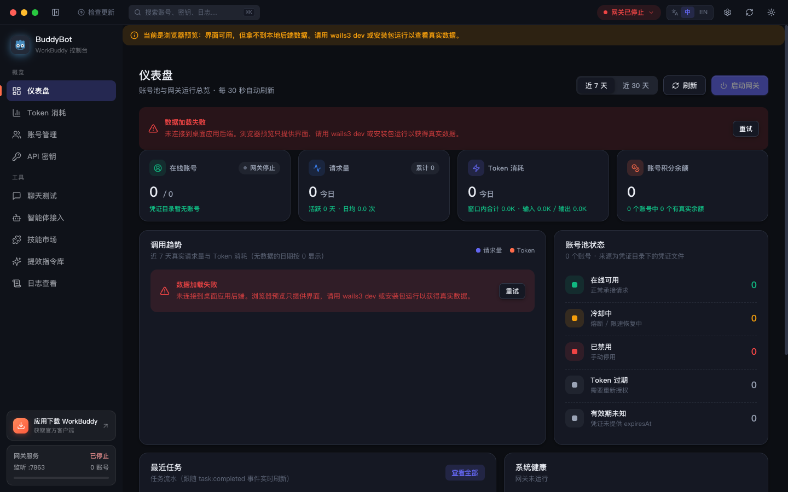
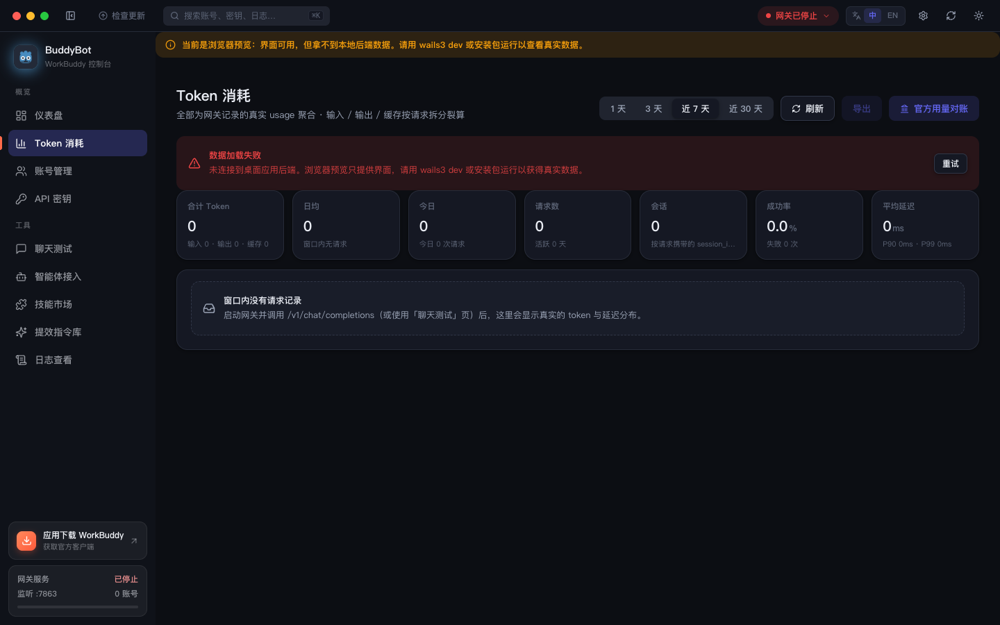
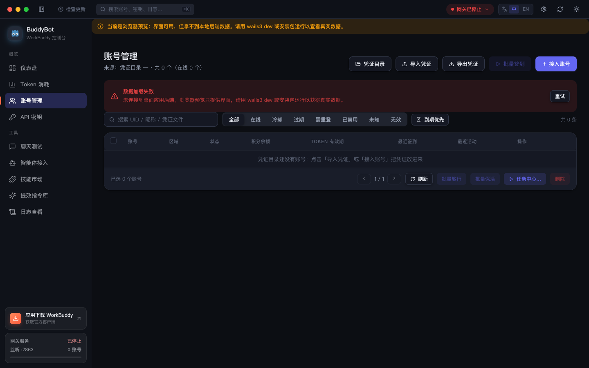
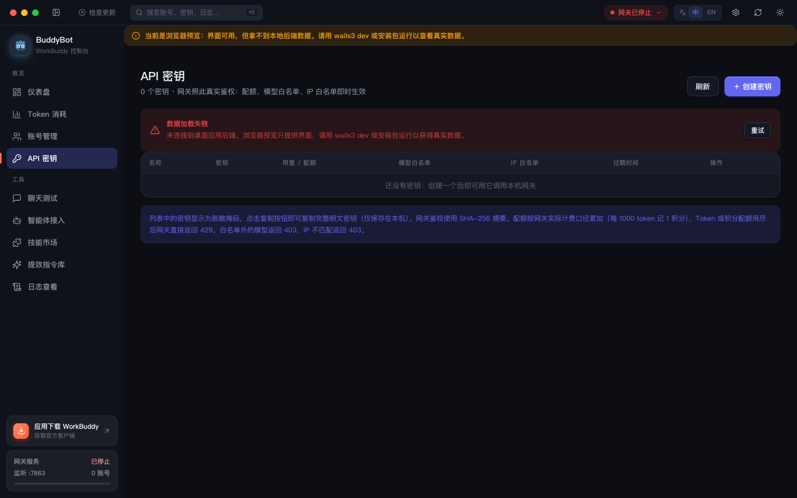
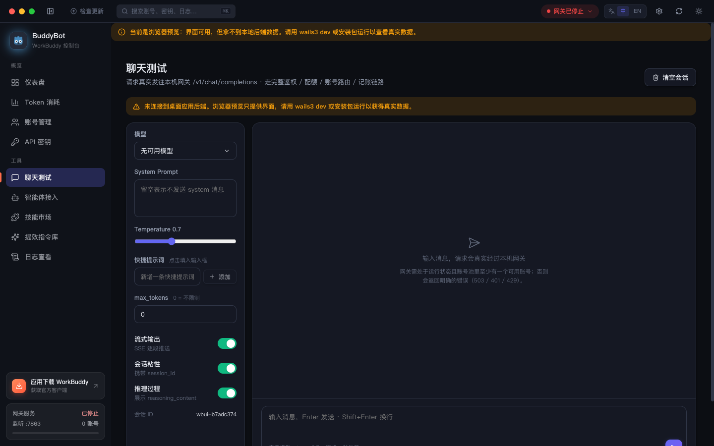
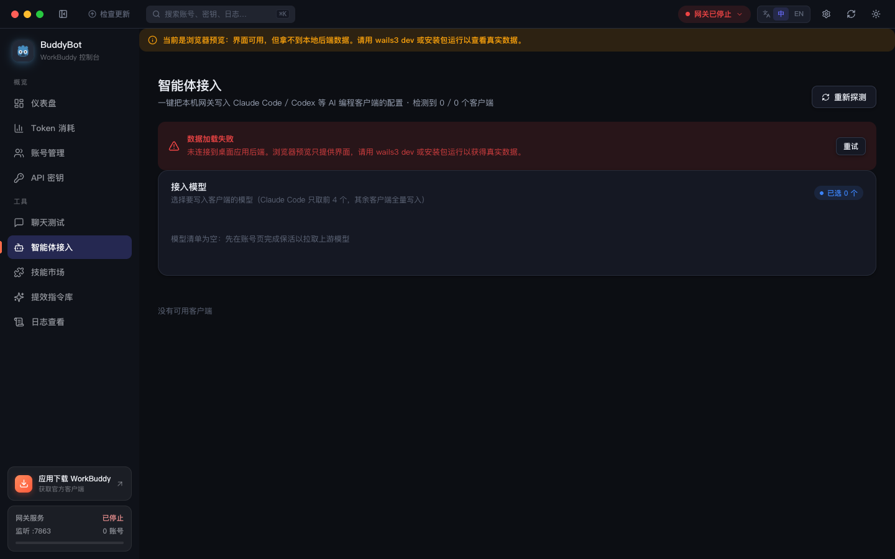
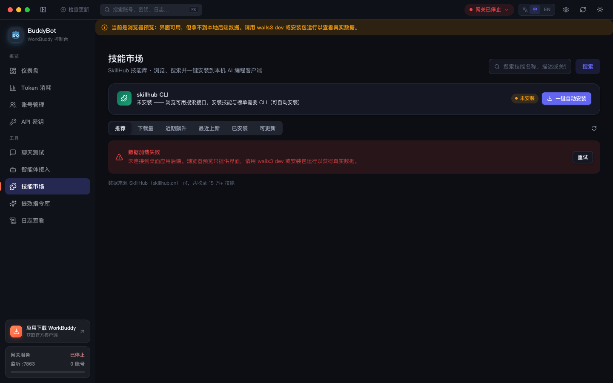
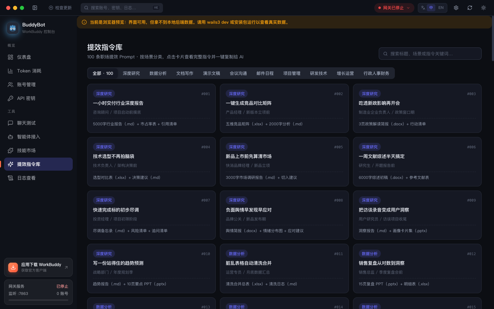
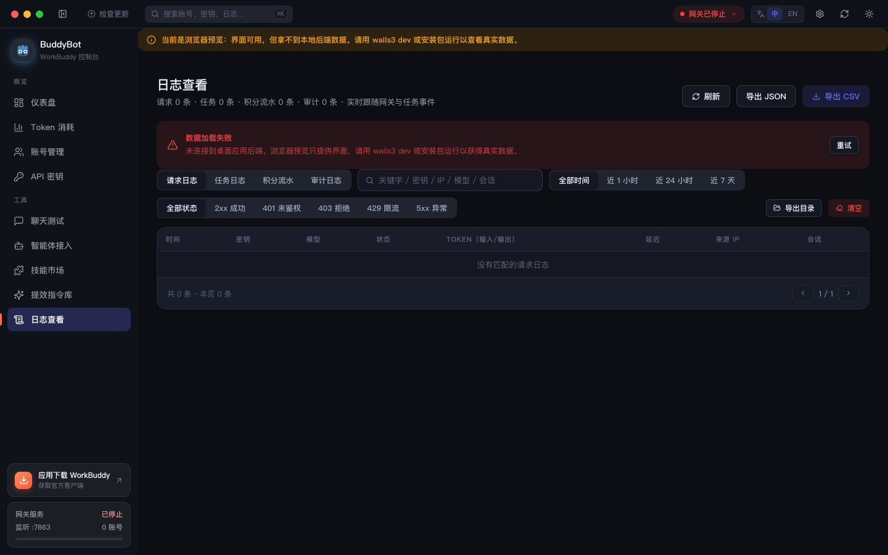
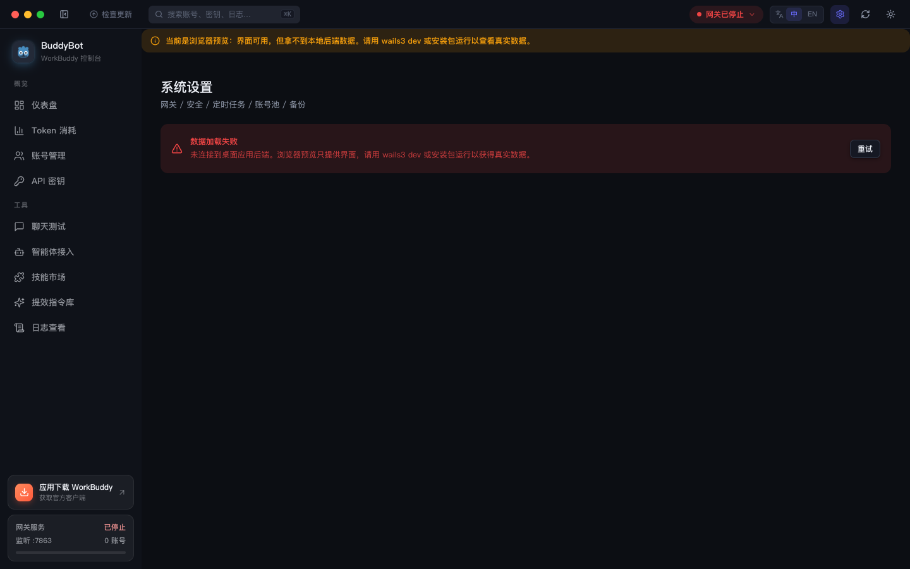

# BuddyBot

<p align="center">
  
</p>

**WorkBuddy 账号池与网关控制台** —— CodeBuddy 账号池管理 + OpenAI 兼容网关的跨平台桌面应用（macOS / Windows / Linux）。

> 把多个官方账号聚合成一个本地账号池，通过统一网关对外提供 `/v1/chat/completions` 服务；账号自动轮换、凭证保活、积分签到全部自动化。

**技术栈**：Wails v3 (beta.23) + Go 1.22+ · React 18 + TypeScript + Vite · Zustand · 设计系统见 `../docs/UI-DESIGN.md`

**仓库地址**：<https://github.com/HanoCode/BuddyBot>

**下载地址**：前往 [Releases 页面](https://github.com/HanoCode/BuddyBot/releases/latest) 下载对应平台的最新安装包（macOS / Windows / Linux）。

### 赞赏支持

如果 BuddyBot 对你有帮助，欢迎请作者喝杯咖啡 ☕

<table>
  <tr>
    <td align="center"><br/><sub><b>微信赞赏码.jpg</b></sub></td>
    <td align="center"><br/><sub><b>支付宝赞赏码.jpg</b></sub></td>
  </tr>
</table>


**赞赏列表**（感谢每一位支持者）

| 日期       | 昵称     |   金额 | 渠道   | 留言               |
| ---------- | -------- | -----: | ------ | ------------------ |
| 2026-09-12 | 星河\_风 | ¥18.88 | 微信   | 猫猫旅行太好用了 😄 |
| 2026-09-15 | M\*\*o   |  ¥6.66 | 支付宝 | 网关很稳，赞一个   |
| 2026-09-18 | 阿哲     | ¥50.00 | 微信   | 加油，期待更多功能 |

---

## 功能清单

**账号池**
- 账号聚合：扫描本机凭证目录自动建池，支持扫码接入（国内/国际版）与凭证导入导出
- 状态推导：在线 / 冷却 / 过期 / 需重登 / 已禁用，全部按真实到期时间计算
- 到期优先：临期积分与 Token 自动排序提醒，优先使用临期资源

**自动化任务**
- 自动签到：每日 `/v2/billing/meter/daily-checkin` + 连登奖励档位兑换 + 抽奖次数用尽
- Token 保活：凭证临期自动刷新写回，顺带查询余额细分（已用/总量/临期作废）并刷新动态模型目录
- 猫猫旅行：领养 / 派出 / 领奖全自动状态机（global 账号无此体系如实跳过）
- 真实调度器：按配置小时触发并写任务日志，可在设置页调整策略

**OpenAI 兼容网关**
- 统一端点 `/v1/chat/completions`，SSE 流式原样中继，非流式 tool_calls 增量聚合重组
- 账号池韧性：429/5xx/401/网络/余额故障自动轮转换号；401 先换新 token 再重试
- 会话粘性：同一 `session_id` 固定同账号，复用上游 prompt 缓存降费用
- 配额与安全：按 key 的 Token/积分配额限流、模型与 IP 白名单、SHA-256 密钥鉴权
- deepseek 系自动注入 `thinking:{type:"enabled"}` + 默认推理档位

**周边能力**
- 智能体一键接入：Claude Code / Codex / OpenCode / Pi / Kimi Code / CodeBuddy 配置自动写入，支持回滚
- 统计报表：Token 消耗、成功率、P50/P90 延迟，全部真实日志聚合
- 客户端消耗：扫描本机 WorkBuddy 会话日志（`~/.workbuddy` / `~/.workbuddy-ai`），聚合客户端自身真实 token 用量（输入/输出/缓存读写、模型/项目/会话排行），与网关口径并列
- 聊天测试：内置调试台完整走鉴权/配额/路由/记账链路
- 日志查看：请求日志 + 任务日志统一检索
- 数据与备份：凭证、配置、密钥本地落盘，支持导出备份

## 界面一览

### 仪表盘

账号池与网关运行总览：在线账号、请求量、Token 消耗、账号积分余额、健康账号占比曲线、账号池状态（在线/冷却/已用/过期分布）、最近任务与系统健康，每 30 秒自动刷新。



### Token 消耗

全部为网关记录的真实 usage 聚合：合计 Token、日均、请求数、会话数、成功率、平均延迟（P50/P90），支持 1/3/7/30 天时间范围切换、按输入/输出/缓存口径拆分及官方用量对照。



### 账号管理

账号池核心：扫描本机凭证目录自动建池，支持扫码接入（国内/国际版）、凭证导入导出、批量签到、批量禁用；按状态（在线/冷却/过期/需重登/已禁用）筛选、到期优先排序；单账号可查看积分余额、Token 有效期、最近活动并手动刷新。



### API 密钥

网关访问密钥管理：创建/吊销 SHA-256 密钥、按 key 配额限流（Token / 积分）、模型与 IP 白名单、用量与最近使用时间记录。



### 聊天测试

内置的 OpenAI 兼容调试台：直连本机网关 `/v1/chat/completions`，支持模型选择（含上下文长度与本机已用提示）、System Prompt、Temperature、max_tokens、流式输出（SSE）、会话粘性、推理档位、快捷提示词，完整走鉴权 / 配额 / 账号路由 / 记账链路。



### 智能体接入

一键把网关接入常用编程智能体客户端，自动写入各自配置文件：

| 客户端 | 写入内容 |
|---|---|
| Claude Code | `~/.claude/settings.json` 的 env（ANTHROPIC_BASE_URL / AUTH_TOKEN / 模型槽位） |
| Codex | `~/.codex/config.toml` 的 model_provider 与 `auth.json` 的 OPENAI_API_KEY |
| OpenCode | `~/.config/opencode/opencode.json` 增加 provider |
| Pi | `~/.pi/agent/models.json` 增加 providers |
| Kimi Code | `~/.kimi-code/config.toml` 的 default_model 与 providers |
| CodeBuddy / WorkBuddy | `models.json` 写入 vendor=WorkBuddy 自定义模型条目（其余模型原样保留） |

支持勾选模型槽位、按家族筛选、一键接入与回滚（undo），客户端备份可随时还原。



### 技能市场

浏览与安装技能包，扩展智能体的领域能力。



### 提效指令库

常用提效指令的收藏与复制，一键写入剪贴板供日常工作复用。



### 日志查看

网关请求日志与定时任务日志的统一查看：按级别/时间过滤、查看单条请求的账号路由、模型、token 用量与错误详情。



### 系统设置

分组配置：通用（语言/主题）、网关服务（端口/开关）、安全与访问（REST Token）、提示词与模型、会话粘性、定时任务调度、账号池策略、数据与备份等，全部落盘本机 `config.json`。



## 网关服务

启动后在本机提供 **OpenAI 兼容** 端点（默认 `:7863`）：

```
POST http://127.0.0.1:7863/v1/chat/completions
Authorization: Bearer <在「API 密钥」创建的密钥>
```

- **流式/非流式**：SSE 原样中继；非流式支持 tool_calls 增量聚合重组
- **账号池韧性**：账号级故障（429/5xx/401/网络/余额）自动轮转换号重试；401 先用 refreshToken 换新 token（原子写回）再重试；同一 `session_id` 按会话粘性固定账号（利于上游 prompt 缓存）
- **配额与白名单**：按 key 的 Token/积分配额限流、模型与 IP 白名单
- **推理模型**：deepseek 系自动注入 `thinking:{type:"enabled"}` + 默认推理档位
- **缓存优化**：按账号隔离注入 `prompt_cache_key`（同会话稳定，复用上游前缀缓存，费用显著下降）

客户端接入示例见 [docs/OPENAI-GATEWAY-INTEGRATION.md](docs/OPENAI-GATEWAY-INTEGRATION.md)，或在「智能体接入」页一键写入。

## 定时任务

真实调度器按配置小时触发并写任务日志：

- **每日签到**：`/v2/billing/meter/daily-checkin` + 连登奖励档位兑换 + 抽奖次数用尽
- **Token 保活**：临期刷新并写回凭证；顺带查询真实余额细分（已用/总量/临期作废分桶）并刷新上游动态模型目录
- **猫猫旅行**：领养/派出/领奖状态机（global 账号无此体系，如实跳过）
- **global 账号签到日**：改领一次性 trial 加油包（幂等 14051）

## 快速开始

```bash
# 安装 Wails CLI（一次性）
go install github.com/wailsapp/wails/v3/cmd/wails3@latest

# 开发模式（热重载）
wails3 dev

# 打包
wails3 build -platform darwin/arm64    # macOS
wails3 build -platform windows/amd64   # Windows
```

纯前端预览（浏览器，仅界面无真实数据）：

```bash
cd frontend && npm install && npm run dev   # http://localhost:5173
```

浏览器预览不连接本地后端，页面会如实显示错误与空态（不会填充模拟数据）；
`wails3 dev` 或安装包运行后即为真实数据。

## 数据来源（真实实现边界）

- **账号**：扫描 `auth_dir` 下真实凭证文件（兼容嵌套/扁平两种形态），状态按真实到期时间推导
- **网关**：SHA-256 密钥鉴权、模型/IP 白名单、Token/积分配额限流、按 key 与账号真实记账
- **上游调用**：真实请求 `{realm-base}/v2/chat/completions`（官方桌面端指纹头 + SSE 流式中继，
  见 `internal/core/upstream.go`）；usage 以上游返回为准，错误按类别驱动账号冷却
- **统计**：全部由请求日志/任务日志真实聚合，无数据源的指标显示为空或「未接入」
- **模型清单**：本地种子目录 + 上游动态目录（keepalive 周期刷新，非对话模型按
  nonChatModel 口径剔除）+ 本机观测三层合并
- 界面上每个数字都必须能追到真数据：**没有 mock 回退**，浏览器环境明确报错或显示空态

## 目录结构

```
workbuddy-desktop/
├── main.go                 # Wails v3 入口（无边框窗口 + 服务注册）
├── tray.go                 # 系统托盘
├── internal/
│   ├── core/               # service / store / gateway / scheduler / accounts / stats / models
│   └── api/                # 服务绑定（Accounts/Config/Gateway/Keys/Logs/System/Stats/Models/Chat/Agents）
├── docs/                   # 网关接入文档 + 界面截图
└── frontend/
    ├── src/
    │   ├── styles/         # tokens.css（设计系统）+ app.css（组件样式）
    │   ├── components/     # layout（TitleBar/Sidebar）+ common（反馈/状态块）
    │   ├── pages/          # Dashboard / Tokens / ClientTokens / Accounts / Keys / Chat / Agents / Skills / Prompts / Logs / Settings
    │   ├── services/       # api.ts（IPC 桥接，零 mock）+ events.ts（后端事件订阅）
    │   ├── hooks/          # useAsync（真实错误暴露）/ useTheme
    │   └── types/          # 从 Wails 生成绑定再导出（单一类型来源）
    ├── bindings/           # wails3 generate bindings 产物（勿手改）
    └── dist/               # 构建产物（go:embed 嵌入二进制）
```

## 开发约定

- 前端只经 `services/api.ts` 访问后端；类型从 `wails3 generate bindings` 产物再导出，禁止手写镜像类型
- 颜色/间距/圆角一律使用 `tokens.css` 变量，禁止硬编码色值
- WAF 指纹脱敏、reasoning effort 降级、活跃上报（对话量刷量）为有意裁剪项：前两者待真实账号
  实测出现风控时按参考实现补齐，活跃上报涉及伪造对话量，不做；出站孤儿 tool_call 配对
  清理与残缺参数检测同属防御项，真实账号实测暴露问题再补
